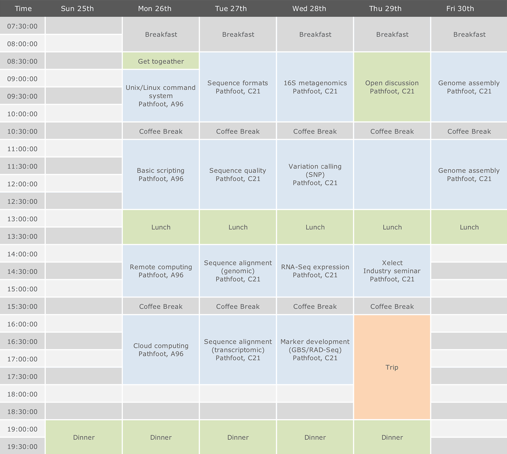

# Introductory Bioinformatic Course to Sequencing Data Processing

## Timetable

Time amd location are subject to changes, but here is the last version of the timetable.

## Content

For further information of this [AquaExcel2020](http://www.aquaexcel2020.eu/) course, please visit the [Wiki](https://github.com/pseudogene/aquaexcel/wiki).

## License & Distribution

Turorials and samples can be found at [https://github.com/pseudogene/aquaexcel/wiki](https://github.com/pseudogene/aquaexcel/wiki).

Except where otherwise noted, materials and tutorials on this course is licensed under a Creative Commons [Attribution-ShareAlike 4.0 International](https://creativecommons.org/licenses/by-sa/4.0/) license.
